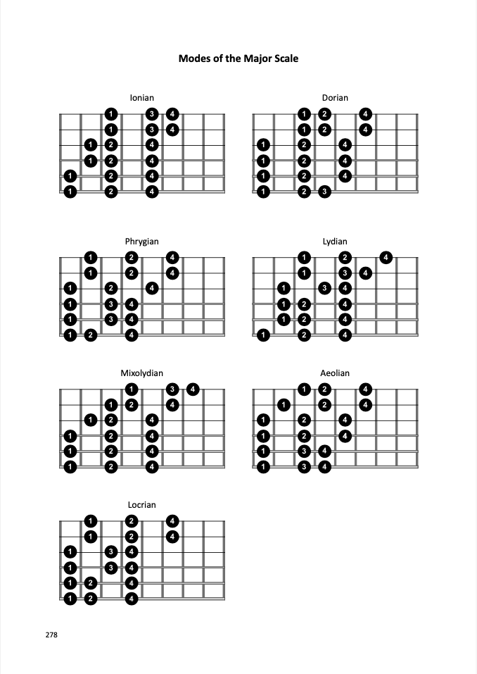
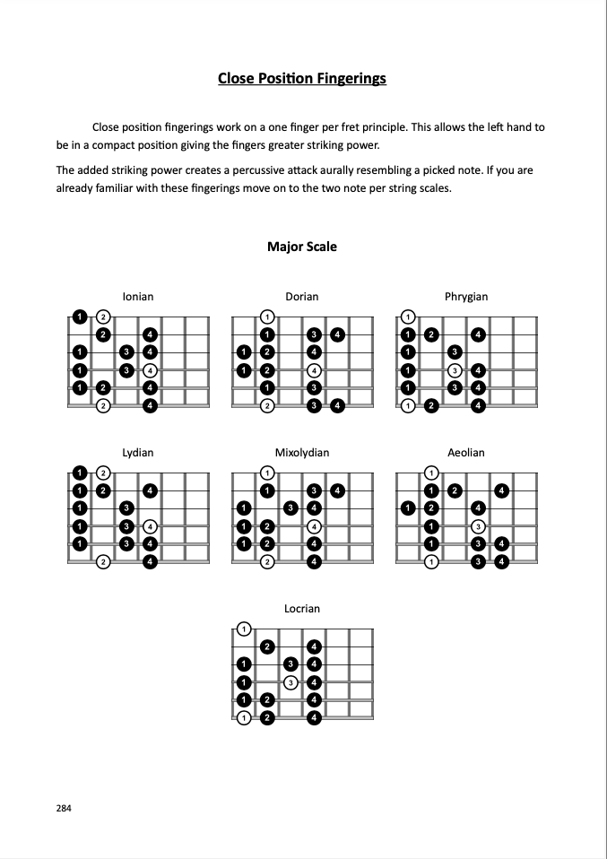
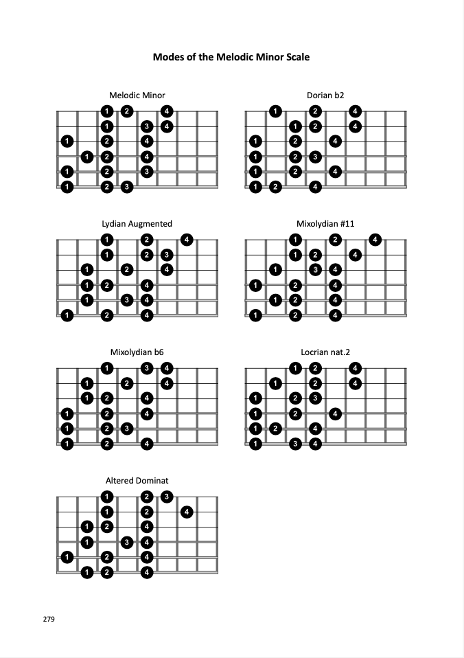
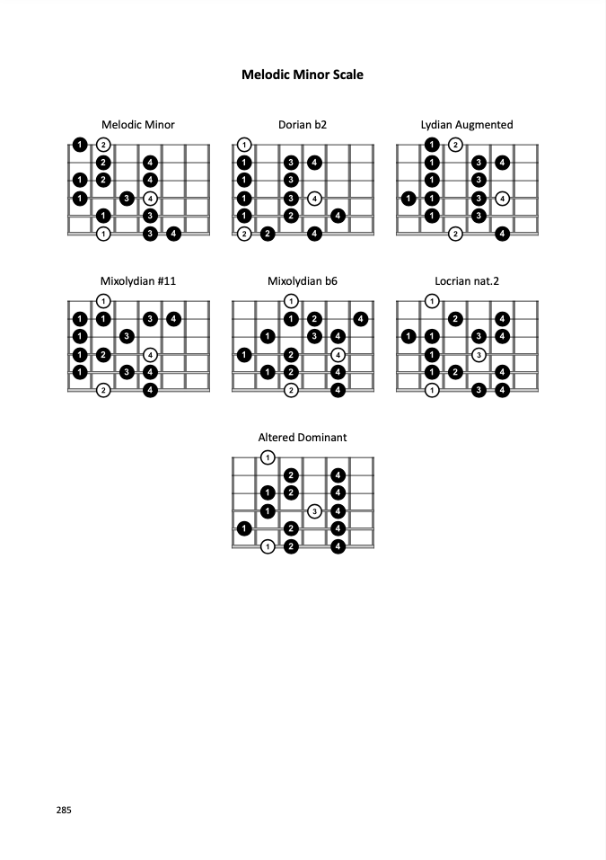
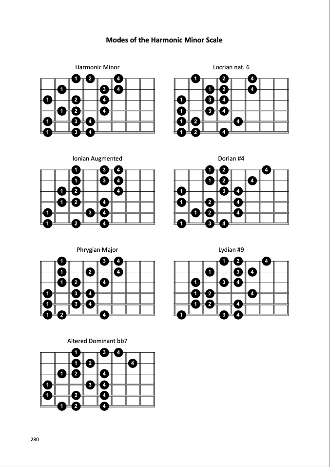
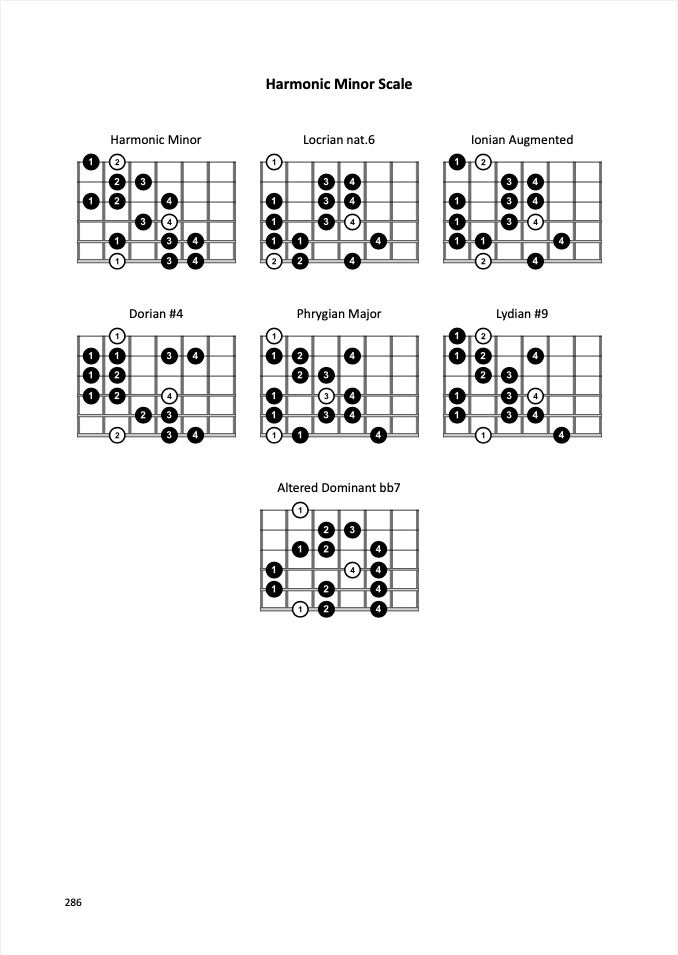
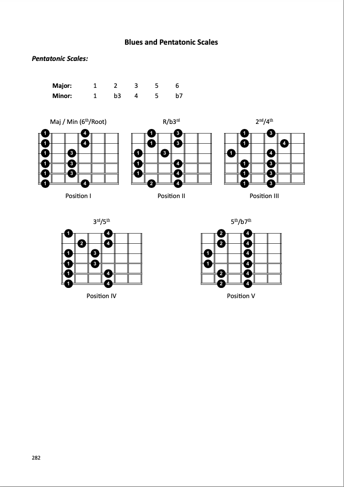
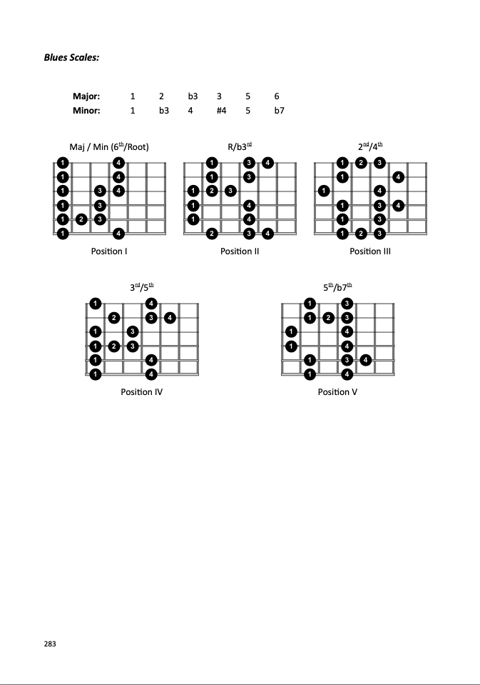

- [major](#major)
  - [per\_3\_major](#per_3_major)
  - [cpf\_major](#cpf_major)
- [melodic\_minor](#melodic_minor)
  - [per\_3\_melodic\_minor](#per_3_melodic_minor)
  - [cpf\_melodic\_minor](#cpf_melodic_minor)
- [harmonic\_minor](#harmonic_minor)
  - [per\_3\_harmonic\_minor](#per_3_harmonic_minor)
  - [cpf\_harmonic\_minor](#cpf_harmonic_minor)
- [pentatonic](#pentatonic)
- [blues](#blues)

# major
## per_3_major

## cpf_major

***
[[Top]](#top)

# melodic_minor
## per_3_melodic_minor

## cpf_melodic_minor

***
[[Top]](#top)

# harmonic_minor
## per_3_harmonic_minor

## cpf_harmonic_minor

***
[[Top]](#top)

# pentatonic

***
[[Top]](#top)

# blues

***
[[Top]](#top)