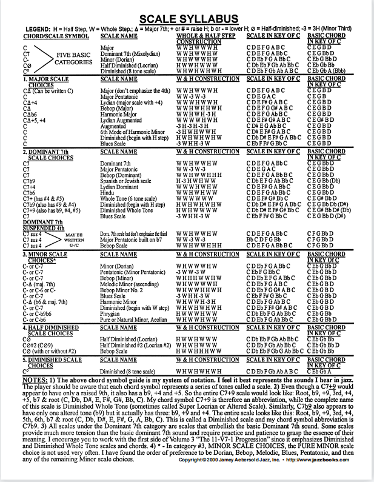
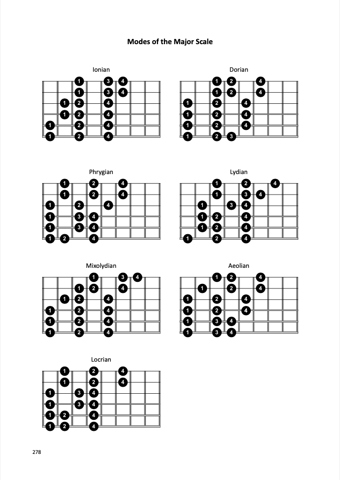
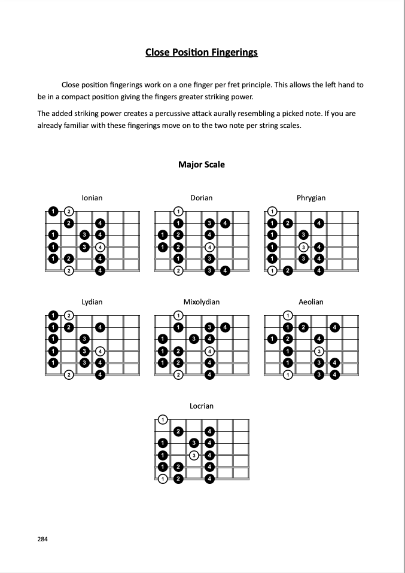
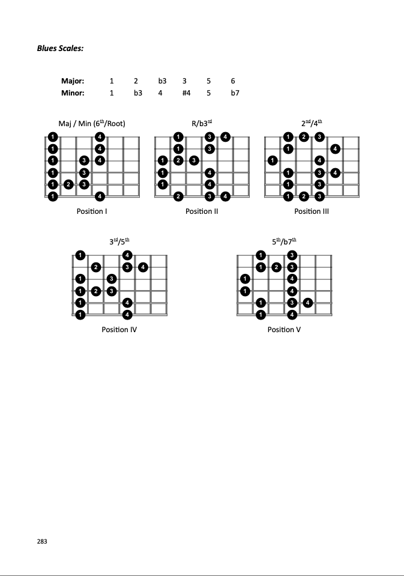
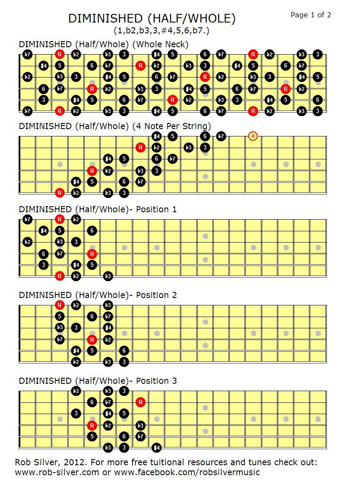

- [chord\_to\_scale](#chord_to_scale)
- [chord\_to\_scale](#chord_to_scale-1)
- [intervals-on-guitar-chart](#intervals-on-guitar-chart)
- [major](#major)
  - [per\_3\_major](#per_3_major)
  - [cpf\_major](#cpf_major)
- [melodic\_minor](#melodic_minor)
  - [per\_3\_melodic\_minor](#per_3_melodic_minor)
  - [cpf\_melodic\_minor](#cpf_melodic_minor)
- [harmonic\_minor](#harmonic_minor)
  - [per\_3\_harmonic\_minor](#per_3_harmonic_minor)
  - [cpf\_harmonic\_minor](#cpf_harmonic_minor)
- [pentatonic](#pentatonic)
- [blues](#blues)
- [diminished\_wh](#diminished_wh)
- [diminished\_hw](#diminished_hw)
- [major-bebop](#major-bebop)
- [dorian-bebop-with3](#dorian-bebop-with3)
- [dorian-bebop-with7](#dorian-bebop-with7)
- [dominant-bebop](#dominant-bebop)
- [whole-tone](#whole-tone)
- [chordex](#chordex)

***

# chord_to_scale

***
[[Top]](#top)
***

# chord_to_scale

***
[[Top]](#top)

# intervals-on-guitar-chart

***
[[Top]](#top)

# major
## per_3_major

## cpf_major

***
[[Top]](#top)

# melodic_minor
## per_3_melodic_minor

## cpf_melodic_minor

***
[[Top]](#top)

# harmonic_minor
## per_3_harmonic_minor

## cpf_harmonic_minor

***
[[Top]](#top)

# pentatonic

***
[[Top]](#top)

# blues

***
[[Top]](#top)

# diminished_wh

***
[[Top]](#top)

# diminished_hw

***
[[Top]](#top)

# major-bebop

***
[[Top]](#top)

# dorian-bebop-with3

***
[[Top]](#top)

# dorian-bebop-with7

***
[[Top]](#top)

# dominant-bebop

***
[[Top]](#top)

# whole-tone

***
[[Top]](#top)

# chordex

